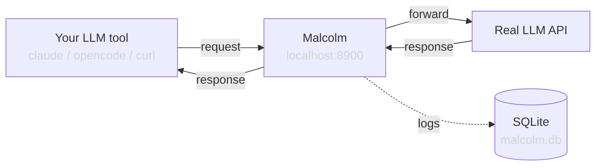

# Malcolm


> [!WARNING]
> Malcolm is in early development. APIs and configuration may change between releases.

A transparent monitoring proxy for LLM API calls. Malcolm sits between your LLM client tools (like [Claude Code](https://claude.ai/code) or [OpenCode](https://github.com/opencode-ai/opencode)) and the actual model backend, logging every request and response for inspection.

## Why?

Tools like `claude` and `opencode` construct complex prompts with system instructions, tool definitions, and conversation history. Malcolm lets you see exactly what gets sent to the model. It's useful for debugging, understanding tool behavior, and optimizing prompts.

## Quick start

```bash
# Either install from `pip`
pip install malcolm-proxy

# Or from `git`
git clone https://github.com/elcapo/malcolm
cd malcolm
uv pip install -e .

# Start the proxy
malcolm --malcolm-target-url=http://localhost:11434/v1
```

Then point your LLM tool to Malcolm:

```bash
ANTHROPIC_AUTH_TOKEN=ollama \
ANTHROPIC_BASE_URL=http://127.0.0.1:8900 \
ANTHROPIC_API_KEY="" \
claude --model qwen3-coder:30b
```

Browse logged requests with the terminal UI:

```bash
malcolm tui                          # uses default malcolm.db
malcolm tui --db-path ./other.db     # use a specific database
```

## Terminal UI

Malcolm includes an agnostic TUI for browsing logs directly from the terminal, without a browser.

Two-level drill-down: **Request list** → **Detail view** (annotations + full JSON with syntax highlighting).

The request list shows ID, timestamp, status code, and duration. When the `llm_annotator` annotator is enabled, additional columns (model, stream) appear dynamically from annotations.

| Key | Action |
|---|---|
| `↑` `↓` | Navigate |
| `Enter` | Open |
| `Esc` | Back |
| `n` / `p` | Next / previous page |
| `f` | Toggle follow mode (auto-refresh every second) |
| `c` | Copy to clipboard (content view) |
| `w` | Toggle word wrap (content view) |
| `r` | Reload |
| `t` | Toggle dark/light theme |
| `q` | Quit |

The TUI reads directly from the SQLite database, so it works while the proxy is running. Use follow mode (`f`) to see new requests appear automatically, or press `r` to refresh manually.

## Configuration

### Environment variables

Core proxy settings via environment variables (or `.env` file):

| Variable | Default | Description |
|---|---|---|
| `MALCOLM_TARGET_URL` | *(required)* | Backend API base URL |
| `MALCOLM_TARGET_API_KEY` | *(empty)* | API key for the backend. If empty, forwards the client's Authorization header |
| `MALCOLM_HOST` | `127.0.0.1` | Listen address |
| `MALCOLM_PORT` | `8900` | Listen port |
| `MALCOLM_STORAGE_ENABLED` | `true` | Enable/disable SQLite persistence |
| `MALCOLM_DB_PATH` | `malcolm.db` | SQLite database file path |
| `MALCOLM_LOG_LEVEL` | `info` | Log level |
| `MALCOLM_CONFIG_FILE` | `malcolm.yaml` | Path to the transform pipeline config file |

### Transform pipeline

Transforms are configured in `malcolm.yaml`. Each transform is a pluggable module that can modify requests and responses as they pass through the proxy. The list order defines the pipeline order.

```yaml
transforms:
  - ghostkey
  - translation:
      direction: anthropic_to_openai
```

Available plugins (the `transforms:` list accepts both):

| Plugin | Kind | Config | Description |
|---|---|---|---|
| `llm_annotator` | annotator | *(none)* | Extracts LLM metadata (model, messages, tools, usage) as annotations for the TUI |
| `ghostkey` | transform | *(none)* | Obfuscates secrets (API keys, tokens) before they reach the backend |
| `translation` | transform | `direction` | Protocol translation: `anthropic_to_openai` or `openai_to_anthropic` |

Transforms mutate the traffic; annotators only observe it and emit structured metadata (no mutation, errors never break forwarding). A single plugin may implement both roles.

Additional plugins can be installed as pip packages — Malcolm discovers them at startup via Python entry points. See [malcolm-proxy/malcolm-transform-example](https://github.com/malcolm-proxy/malcolm-transform-example) for a working reference implementation you can install directly (`uv pip install git+https://github.com/malcolm-proxy/malcolm-transform-example`) or fork as a template for your own.

See [docs/configuration.md](docs/configuration.md) for details and [docs/scenarios.md](docs/scenarios.md) for complete setup examples with Claude Code, OpenCode, and various backends (Anthropic, OpenAI, Ollama).

## How it works



Malcolm acts as a catch-all proxy: it accepts requests in any format (OpenAI, Anthropic, or any other HTTP API), captures the full request, forwards it to the configured backend, captures the full response (including streaming), and stores everything in a local SQLite database for later inspection.

When client and backend speak different protocols, Malcolm can translate between them on the fly. Add `translation` to the transform pipeline in `malcolm.yaml` with the desired direction, and Malcolm will automatically convert requests, responses, and streaming events; including path rewriting (from `/v1/messages` to `/v1/chat/completions` and viceversa).

See [docs/architecture.md](docs/architecture.md) for the full architecture overview.

## Development

```bash
# Install with dev dependencies
uv sync

# Run tests
uv run pytest

# Run the proxy
uv run malcolm
```

## License

Malcolm is distributed under a MIT license. See [LICENSE](./LICENSE) for more details.
