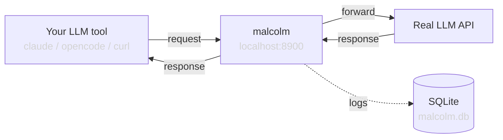

# Architecture

## Overview

malcolm is a transparent HTTP proxy that sits between LLM client tools and model API backends. It implements the OpenAI Chat Completions API, forwards all requests to a configurable backend, and logs everything to SQLite for inspection.

## Components

### `config.py` — Settings

Uses `pydantic-settings` to load configuration from environment variables. All variables are prefixed with `MALCOLM_`. See [configuration.md](configuration.md) for details.

### `models.py` — Canonical Models

Format-agnostic dataclasses (`Message`, `ToolCall`, `Conversation`) that represent normalized LLM request/response data. Used by the TUI and any other consumer that needs to display or inspect stored data without caring about the wire format.

### `formats.py` — Format Detection and Normalization

Dispatch-based layer that converts raw stored data into canonical models. Each supported protocol (OpenAI, Anthropic) has a parser class that implements format detection (`can_parse_*`) and extraction. The `parse_record()` function iterates over parsers to find the right one for each record. Also provides `assemble_openai_chunks()` used by the proxy to assemble streaming chunks for storage.

### `storage.py` — Persistence

Two implementations:
- **`Storage`**: Real SQLite persistence using `aiosqlite` with WAL mode for concurrent access. Stores full request/response JSON, streaming chunks, timing, and errors.
- **`NullStorage`**: No-op implementation used when `MALCOLM_STORAGE_ENABLED=false`. Same interface, does nothing.

Two tables:
- **`requests`**: Original unmodified data — what the client sent and what the backend returned.
- **`request_transforms`**: Transform outputs keyed by `(request_id, transform_type)`. Each row stores how the request/response looked after a specific transform (e.g. `"ghostkey"`, `"translation"`). Cascade-deletes with the parent request.

### `transforms.py` — Transform Pipeline

Pluggable pipeline that modifies requests before they reach the backend and responses before they reach the client. Each transform implements the `Transform` protocol:

- **`GhostKeyTransform`**: Scans for secrets and replaces them with format-preserving fakes. Restores originals in responses. Delegates to core functions in `ghostkey.py`.
- **`TranslationTransform`**: Converts between Anthropic and OpenAI API formats. Delegates to pure functions in `translate.py`.

The pipeline is assembled at startup via `build_pipeline(settings)`. Transforms are applied in order on requests and in reverse order on responses. Each transform's output is persisted to the `request_transforms` table so the TUI can show both raw and transformed data.

### `proxy.py` — Core Proxy Logic

Handles two code paths:

**Non-streaming**: Sends the request to the backend, waits for the full response, saves it, and returns it.

**Streaming (SSE)**: Opens a streaming connection to the backend, yields each Server-Sent Events line to the client in real-time while also accumulating chunks in memory. When the stream ends, it assembles the chunks into a single response object and saves it to storage.

Key behaviors:
- Uses a long-lived `httpx.AsyncClient` for connection pooling (300s timeout)
- Forwards auth headers: uses `MALCOLM_TARGET_API_KEY` if set, otherwise passes through the client's `Authorization` header
- Assembles streaming chunks into a complete response for easier inspection
- Applies the transform pipeline and persists both original and transformed data

### `app.py` — FastAPI Application

Wires everything together:
- Lifespan management (httpx client, storage initialization/cleanup)
- Route registration: catch-all proxy that forwards any unmatched route to the backend

### `tui.py` — Terminal Log Viewer

A Textual-based TUI for browsing logged requests from the terminal. Three-level drill-down: **Sessions** → **Requests** → **Messages** → **Message detail** (full JSON with syntax highlighting). Vim-style keybindings. Consumes canonical `Conversation`/`Message` objects from `formats.py`, with no format-specific logic. Press `t` in Messages or Detail screens to toggle between raw and transformed views.

### `translate.py` — Protocol Translation

Optional bidirectional translation between Anthropic and OpenAI API formats. Activated by adding `translation` to the transform pipeline in `malcolm.yaml`. Contains pure functions for:

- **Request translation**: Converts message formats, system prompts, tool definitions, and images between protocols.
- **Response translation**: Converts response envelopes, stop reasons, and usage stats.
- **Streaming translation**: State machines that translate SSE events line-by-line between OpenAI's `data:` format and Anthropic's `event:`/`data:` format.
- **Path rewriting**: Maps `/v1/messages` ↔ `/v1/chat/completions`.

### `cli.py` — Entry Point

Loads settings and starts uvicorn. Registered as the `malcolm` console script.

## Request Flow

1. Client sends a request to malcolm
2. malcolm parses the request body and creates a `RequestRecord` with a UUID and timestamp
3. The raw request body is saved to the `requests` table
4. The transform pipeline runs on the request (ghostkey → translation), each step saved to `request_transforms`
5. The transformed request is forwarded to the backend
6. The raw backend response is saved to the `requests` table
7. The transform pipeline runs in reverse on the response (translation → ghostkey), each step saved to `request_transforms`
8. The transformed response is returned to the client
9. For streaming: SSE lines are transformed on the fly and raw backend chunks are accumulated for storage

## Design Principles

- **Transparency**: Forward everything as-is by default. Don't transform, filter, or validate beyond what's needed to proxy. When translation is enabled, convert between protocols faithfully without dropping fields. Raw data is stored as-is; normalization happens at read time (in `formats.py`), not at write time.
- **Observability**: Capture everything. Full request bodies, full responses, individual streaming chunks, timing, errors.
- **Simplicity**: Minimal dependencies, single SQLite file, no external services needed.
- **Optional persistence**: Storage can be disabled for pure pass-through monitoring via stdout logs.
