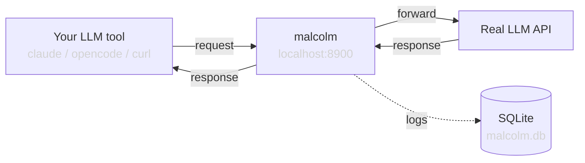

# Architecture

## Overview

malcolm is a transparent HTTP proxy that sits between LLM client tools and model API backends. It implements the OpenAI Chat Completions API, forwards all requests to a configurable backend, and logs everything to SQLite for inspection.

## Components

### `config.py` — Settings

Uses `pydantic-settings` to load configuration from environment variables. All variables are prefixed with `MALCOLM_`. See [configuration.md](configuration.md) for details.

### `models.py` — Pydantic Models

Minimal OpenAI-compatible models with `extra="allow"` to be transparent. malcolm doesn't validate the full OpenAI spec — it accepts any fields and passes them through. This ensures compatibility with new API features without code changes.

### `storage.py` — Persistence

Two implementations:
- **`Storage`**: Real SQLite persistence using `aiosqlite` with WAL mode for concurrent access. Stores full request/response JSON, streaming chunks, timing, and errors.
- **`NullStorage`**: No-op implementation used when `MALCOLM_STORAGE_ENABLED=false`. Same interface, does nothing.

### `proxy.py` — Core Proxy Logic

Handles two code paths:

**Non-streaming**: Sends the request to the backend, waits for the full response, saves it, and returns it.

**Streaming (SSE)**: Opens a streaming connection to the backend, yields each Server-Sent Events line to the client in real-time while also accumulating chunks in memory. When the stream ends, it assembles the chunks into a single response object and saves it to storage.

Key behaviors:
- Uses a long-lived `httpx.AsyncClient` for connection pooling (300s timeout)
- Forwards auth headers: uses `MALCOLM_TARGET_API_KEY` if set, otherwise passes through the client's `Authorization` header
- Assembles streaming chunks into a complete response for easier inspection

### `app.py` — FastAPI Application

Wires everything together:
- Lifespan management (httpx client, storage initialization/cleanup)
- Route registration: `/v1/chat/completions`, `/chat/completions`, `/v1/models`
- Mounts the viewer router

### `viewer.py` — Log Inspector

Provides both HTML and JSON interfaces for inspecting logged requests:
- `/logs` — HTML list of recent requests
- `/logs/{id}` — HTML detail view with full request/response
- `/api/logs` — JSON API for programmatic access
- `/api/logs/{id}` — JSON detail endpoint

### `cli.py` — Entry Point

Loads settings and starts uvicorn. Registered as the `malcolm` console script.

## Request Flow

1. Client sends `POST /v1/chat/completions` to malcolm
2. malcolm parses the request body (minimal validation, preserves all fields)
3. malcolm creates a `RequestRecord` with a UUID and timestamp
4. malcolm forwards the request to `MALCOLM_TARGET_URL/chat/completions`
5. For non-streaming: waits for response, saves record, returns response
6. For streaming: yields SSE lines to client while accumulating, saves assembled response after stream ends
7. Record is persisted to SQLite (if storage is enabled)

## Design Principles

- **Transparency**: Forward everything as-is. Don't transform, filter, or validate beyond what's needed to proxy. Use `extra="allow"` on models.
- **Observability**: Capture everything. Full request bodies, full responses, individual streaming chunks, timing, errors.
- **Simplicity**: Minimal dependencies, single SQLite file, no external services needed.
- **Optional persistence**: Storage can be disabled for pure pass-through monitoring via stdout logs.
